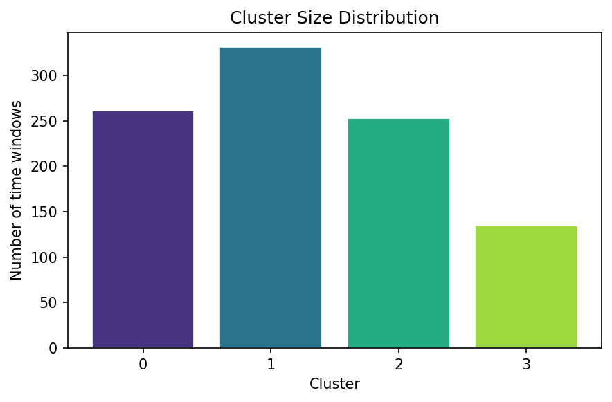

# Neural Representation Explorer

Explores how high-dimensional neural spike activity forms low-dimensional structure.

## Pipeline

```
spike simulation → firing rate features → dimensionality reduction → clustering → visualization
```

1. **Simulate spikes** — Poisson spike trains for a population of neurons
2. **Compute features** — Sliding-window firing rates across the population
3. **Reduce dimensionality** — PCA and UMAP projections into 2D
4. **Cluster states** — K-Means clustering of neural population states
5. **Visualize** — Plot the neural manifold colored by cluster identity

## Latest Results

> Full results and all figures are in [`results/RESULTS.md`](results/RESULTS.md)

### Neural Manifolds (PCA & UMAP)

Neural population states projected into 2D, colored by K-Means cluster labels.


### Spike Raster


### Firing Rate Heatmap


### PCA Explained Variance


### Cluster Distribution



## Getting Started

```bash
pip install -r requirements.txt
```

### Run the pipeline

```bash
python run_pipeline.py
```

This generates all figures and a summary in the `results/` directory.

### Or use the notebook interactively

```bash
jupyter notebook notebooks/explore_representations.ipynb
```

## CI / Automated Results

A GitHub Actions workflow (`.github/workflows/run_pipeline.yml`) automatically re-runs the pipeline whenever `src/`, `run_pipeline.py`, or `requirements.txt` change on `main`. Results are committed back to the repo so the figures above always reflect the latest code.

You can also trigger a run manually via the **Actions** tab → **Run Neural Pipeline** → **Run workflow**.

## Project Structure

```
neural_representation_explorer/
    README.md
    requirements.txt
    run_pipeline.py
    .github/workflows/run_pipeline.yml
    src/
        simulate_spikes.py
        compute_features.py
        dimensionality.py
        clustering.py
    notebooks/
        explore_representations.ipynb
    results/           (auto-generated)
        RESULTS.md
        manifolds.png
        spike_raster.png
        firing_rates.png
        pca_variance.png
        cluster_distribution.png
        summary.json
```

## Future Work

- Apply to real neural datasets (e.g. Neuropixels recordings)
- Test different manifold learning methods (t-SNE, Isomap)
- Study temporal dynamics and state transitions
