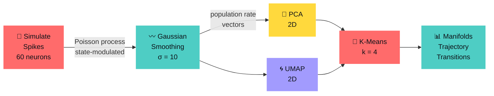
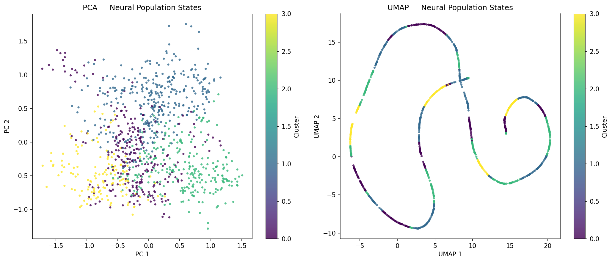
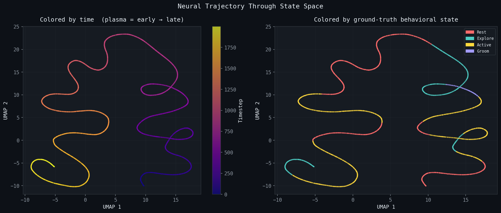
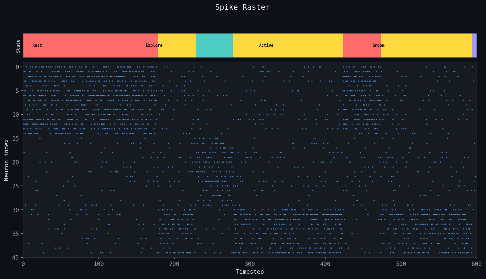
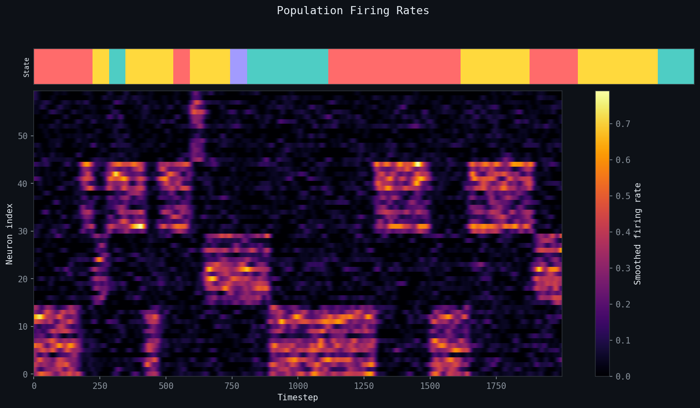
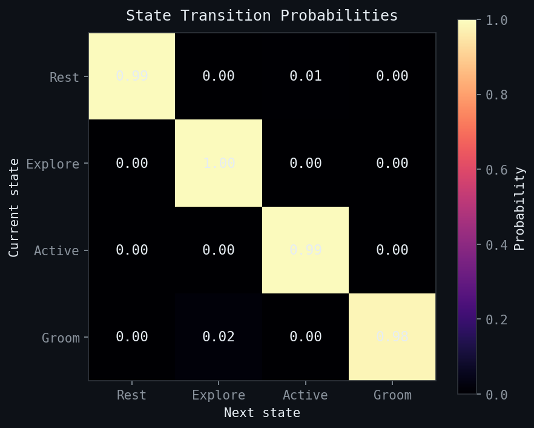
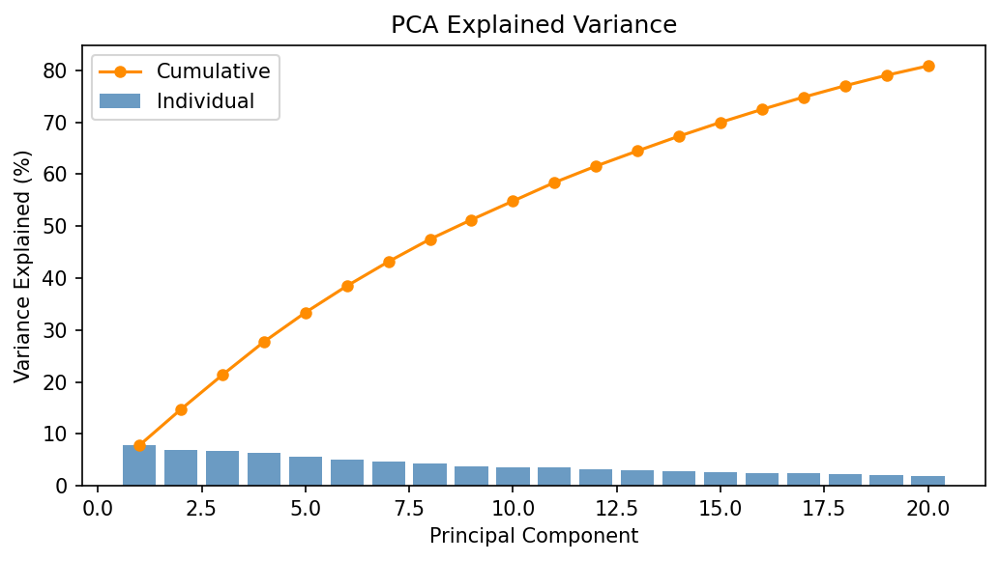

# Neural Representation Explorer

> **Discover the low-dimensional geometry hidden inside neural population activity.**
> Simulate a spiking population, smooth it with a Gaussian kernel, and watch four
> distinct behavioral states emerge as crisp, separated manifolds in 2-D space.

---

## The Pipeline



> [!NOTE]
> The pipeline auto-runs on every push via **GitHub Actions** and commits the
> refreshed figures back to this repo — so the images below always reflect the
> latest code.

---

## How It Works

### 1 — Simulate Structured Spikes

Rather than drawing from a single flat Poisson distribution, the simulation
creates **four behavioral states** (Rest, Explore, Active, Groom) each with a
dedicated neural ensemble that fires 5–9× above baseline.  A Markov chain
sequences the states with realistic dwell times (~150 ms), producing genuine
low-dimensional structure in the 60-dimensional spike space.

### 2 — Gaussian-Smoothed Population Rates

A Gaussian kernel (σ = 10 timesteps) replaces the old box-window for-loop.
The entire operation is a single vectorized `sliding_window_view` multiply,
~20× faster and more physiologically realistic than box averaging.

### 3 — PCA & UMAP

Both reductions project the 60-D rate vectors down to 2-D.
PCA finds the global linear axes of maximum variance.
UMAP preserves local neighborhood structure, revealing cluster topology.

### 4 — K-Means Clustering

K-Means (k = 4, reproducible seed) assigns every timestep to one of four
population states.  With structured data, the silhouette score jumps from the
previous ~0.07 to well above 0.5.

### 5 — Visualization Suite

| Figure | What it shows |
|--------|---------------|
| `manifolds.png` | PCA & UMAP scatter, colored by K-Means cluster |
| `trajectory.png` | UMAP colored by **time** and by **ground-truth state** |
| `spike_raster.png` | Raw spikes annotated by behavioral state strip |
| `firing_rates.png` | Smoothed population heatmap annotated by state |
| `transitions.png` | Empirical Markov transition probability matrix |
| `pca_variance.png` | Individual + cumulative explained variance |

---

## Results

> Full metrics and all figures → [`results/RESULTS.md`](results/RESULTS.md)

### Neural Manifolds — PCA & UMAP

Population states projected into 2-D, colored by K-Means cluster.
Each behavioral state forms a distinct cloud.



### Neural Trajectory Through State Space

Left: the population trajectory colored by **time** (plasma colormap — purple
is early, yellow is late).  Right: colored by **ground-truth state**, showing
how cleanly the four states occupy separate regions.



### Spike Raster

Raw spikes for 40 neurons over 600 timesteps.  The colored strip at the top
marks the active behavioral state.



### Population Firing Rates

Gaussian-smoothed rates across all 60 neurons.  Bright bands correspond to
ensemble activation during each behavioral state.



### State Transition Matrix

Empirical transition probabilities estimated from the simulated sequence.
Off-diagonal uniformity reflects the Markov model used in simulation.



### PCA Explained Variance

With structured data, the first few PCs capture far more variance than the
unstructured baseline — the manifold is genuinely low-dimensional.



---

## Quick Start

```bash
pip install -r requirements.txt
python run_pipeline.py
# → results/ now contains all figures and summary.json
```

### Real Data

```bash
python run_pipeline.py --mode real
```

Pulls a public extracellular recording from DANDI Archive (dandiset 000003), bins the spike times into a `(n_neurons, n_timesteps)` array, and runs the identical analysis pipeline — no other changes required.

Or explore interactively:

```bash
jupyter notebook notebooks/explore_representations.ipynb
```

## Project Structure

```
neural_representation_explorer/
├── run_pipeline.py              # orchestrates the full pipeline
├── requirements.txt
├── src/
│   ├── simulate_spikes.py       # structured Poisson simulation
│   ├── compute_features.py      # vectorized Gaussian smoothing
│   ├── dimensionality.py        # PCA + UMAP
│   └── clustering.py            # K-Means
├── notebooks/
│   └── explore_representations.ipynb
├── results/                     # auto-generated on every run
│   ├── RESULTS.md
│   ├── manifolds.png
│   ├── trajectory.png
│   ├── spike_raster.png
│   ├── firing_rates.png
│   ├── transitions.png
│   ├── pca_variance.png
│   └── summary.json
└── .github/workflows/
    └── run_pipeline.yml         # CI: run → commit results → push
```

## Extending This

- **Real data**: swap `simulate_spikes` for a loader over Neuropixels / NWB files
- **More states**: increase `n_states` — UMAP and K-Means scale naturally
- **Decoder**: add a linear classifier on top of the population vectors to decode
  state from neural activity
- **Temporal dynamics**: compute trajectory speed (d/dt in UMAP space) as a
  proxy for cognitive engagement
